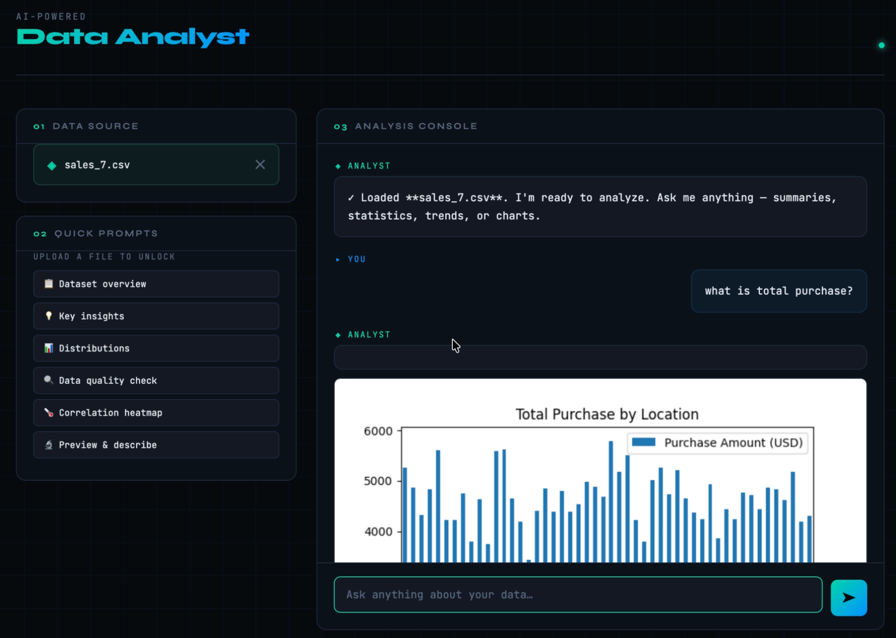

# 🚀 FastAPI Project Setup Guide

## 📌 Overview

This is a simple FastAPI project setup without database or Docker.
Features:
- Upload CSV file
- Ask questions about data analysis
- Powered by Groq API

------------------------------------------------------------------------

## 🛠️ Requirements

-   Python 3.10+
-   pip

------------------------------------------------------------------------

## 📂 Project Structure

project/ │── app/ │ └── main.py │ │── requirements.txt │── README.md

------------------------------------------------------------------------

## ⚙️ Installation

### 1. Clone repository

git clone `<your-repo-url>`{=html} cd project

### 2. Create virtual environment

python -m venv venv

### 3. Activate virtual environment

Mac/Linux: source venv/bin/activate

Windows: venv`\Scripts`{=tex}`\activate`{=tex}

### 4. Install dependencies

pip install -r requirements.txt

### 5. Put key in file .env
GROQ_API_KEY='your API key here'

------------------------------------------------------------------------

## ▶️ Run the Application

uvicorn app.main:app --reload

App will run at: http://127.0.0.1:8000

------------------------------------------------------------------------

## ❗ Common Issues

### Port already in use

Change port: uvicorn app.main:app --reload --port 8001

### Module not found

Make sure you're inside the project folder and virtual environment is
activated.

------------------------------------------------------------------------

## Screenshot

